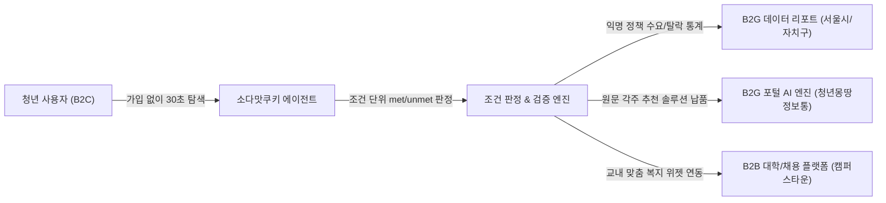
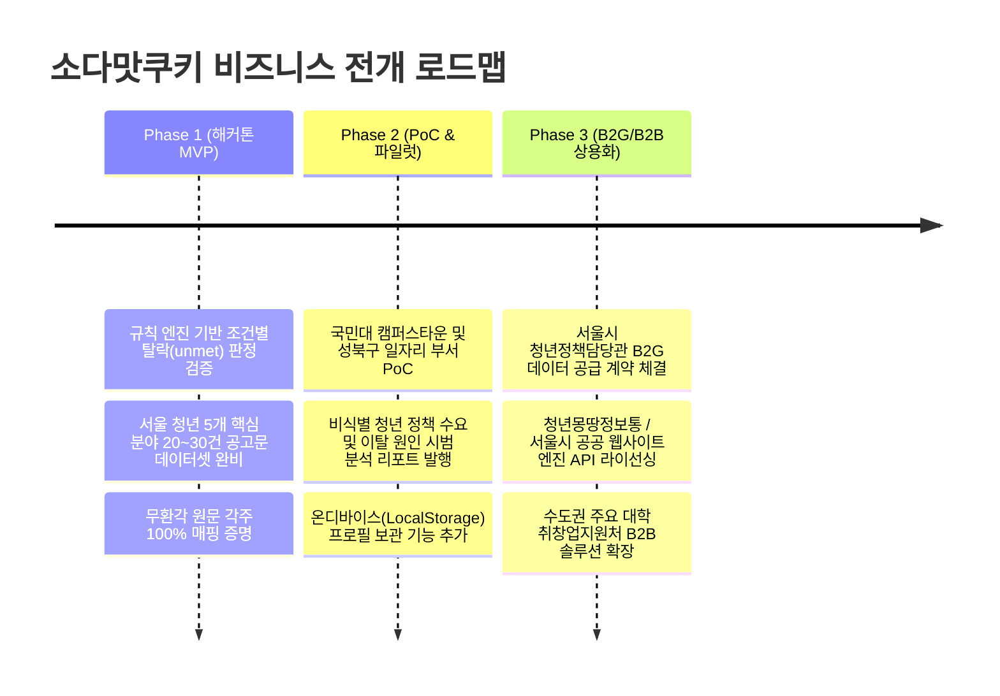

# 11. 비즈니스 모델과 지속 가능성 (BM)

> 출처: 팀 회의 및 비즈니스 전략. 소유: 공통 (백엔드B 관리).
> 이 문서는 "소다맛쿠키" 청년 공공지원제도 AI 에이전트의 수익 모델(BM), 고객 가치 제안, 데이터 판매 전략 및 개인정보 컴플라이언스를 정리한 문서다.
> 발표 시 "수익 창출 방안" 및 "지자체 연계 지속 가능성" 질의응답의 기준으로 쓴다.

---

## 1. 비즈니스 개요 및 핵심 철학

### 1-1. 한 줄 정의
**"청년에게는 개인정보 없는 30초 맞춤 탐색을, 지자체에게는 예산 낭비를 막는 정책 사각지대 데이터를."**

### 1-2. 핵심 포지셔닝: Privacy-by-Design & Data Intelligence
대부분의 청년 서비스는 개인정보(이름, 연락처, 소득 증빙)를 수집하려다 진입장벽을 높이고 개인정보보호법 리스크를 안습니다.
본 서비스는 **개인식별정보(PII)를 일체 수집·저장하지 않는 '개인정보 최소화 원칙'**을 지키면서, 기계적으로 세분화된 조건 판정 엔진을 통해 **지자체가 가장 목말라하는 '비식별 정책 수요 및 탈락 원인 데이터'를 정제·가공하여 판매**합니다.

---

## 2. 고객 및 문제 정의 (Why B2G/B2B?)

| 타깃 고객 | 겪고 있는 문제 (Pain Point) | 우리의 가치 제안 (Value Proposition) |
| :--- | :--- | :--- |
| **청년 (B2C 사용자)** | • 자격 요건이 복잡해 신청 전 포기 • 가입 및 개인정보 요구 시 90% 이탈 • 지원제도 발견 시점이 이미 마감 직전 | • 가입·개인정보 없는 30초 1차 결과 • 모든 조건의 원문 근거와 각주 제공 • 마감 임박 알림 및 맞춤 체크리스트 |
| **서울시 / 25개 자치구 (B2G 고객)** | • 매년 수천억 청년 예산을 쓰지만 청년 이탈 원인(사각지대) 데이터 부재 • 공고문 중심의 일방향 전달로 낮은 예산 집행률 • 자격 문의 단순 민원으로 행정력 낭비 | • 비식별 청년 정책 수요 및 조건별 이탈률 분석 리포트 • 공고문만 넣으면 원문 각주가 자동 생성되는 추천 엔진 솔루션 • 단순 민원 상담 비용 대폭 감축 |
| **대학 취창업처 / 채용 플랫폼 (B2B 고객)** | • 재학생 복지 수혜율 및 취업 지원 지표 개선 필요 • 교외 공공 지원제도와 교내 지원제도의 통합 안내 창구 부재 | • 학사 정보 연동 맞춤형 공공+교내 지원금 안내 위젯 • 캠퍼스 재학생 맞춤형 청년 정책 대시보드 |

---

## 3. 3대 핵심 수익 모델 (Revenue Streams)

### BM 1. [B2G Data] 서울시·자치구 대상 '청년 정책 사각지대 인텔리전스' 구독 (DaaS)
* **제공 대상**: 서울시 청년정책담당관, 25개 자치구 일자리청년과, 국무조정실 청년정책조정실
* **판매 상품**: 개인정보가 배제된 **"분기별 청년 정책 수요 및 이탈 원인 분석 리포트"**
* **데이터 원천 (우리가 파악하는 탈락 지점)**:
  * 우리 엔진은 정책마다 `conditions`의 세부 조건(나이, 소득, 신분, 주거 등)을 `met`/`unmet`/`unknown`으로 기계적 판정함.
  * **수집 데이터 예시**:
    * *"관악구 거주 20대 청년의 68%가 주거 지원을 조회했으나, '부모 소득 합산' 조건에서 전원 미충족(unmet) 이탈"*
    * *"성북구 대학생들은 취업 장려금보다 '자격증 응시료 지원' 및 '면접 정장 대여'에 3.2배 더 높은 관심 집계"*
    * *"신청 체크리스트 조회 후 '부모 건강보험료 납부확인서' 단계에서 최종 신청 포기율 41% 기록"*
* **수익 방식**: 지자체별 연간 데이터 구독 라이선스 (Annual Subscription)

### BM 2. [B2G Solution] 서울청년포털(청년몽땅정보통) 'AI 원문 각주 판정 엔진' 납품 (SaaS)
* **제공 대상**: 서울시 및 지자체 공공 복지 포털 운영 부서
* **판매 상품**: 우리가 독자 구축한 **"공고 원문 각주 검증 및 규칙 판정 엔진 API"**를 공공 포털에 화이트라벨(White-label) 형태로 연동
* **고객 편익**:
  * 공무원은 길고 복잡한 공고문 텍스트만 업로드하면, 엔진이 자격 조건/마감일/서류를 추출하고 인용 검증(`verify.py`)을 거쳐 청년에게 원문 각주 형태로 자동 제공.
  * 지자체 콜센터의 "저도 지원 대상인가요?" 반복 민원을 70% 이상 자동화.
* **수익 방식**: 초기 시스템 연동 구축비(SI) + 월간/연간 클라우드 라이선스 및 유지보수료

### BM 3. [B2B Campus] 대학교 취창업지원처 연계 맞춤 복지 솔루션
* **제공 대상**: 국민대학교 등 캠퍼스타운 참여 대학, 대학 일자리플러스센터
* **판매 상품**: 대학 포털 내 탑재되는 **"재학생 맞춤 청년 공공지원 알리미 위젯"**
* **고객 편익**:
  * 대학생들에게 중앙정부/서울시의 청년 지원금을 교내 포털에서 원클릭으로 안내하여 재학생 만족도 증대 및 대학 기관평가 취업·복지 지표 향상.
* **수익 방식**: 대학별 연간 소프트웨어 라이선스 과금

---

## 4. 개인정보보호 및 규제 준수 (Privacy & Compliance)

본 비즈니스 모델의 가장 강력한 방어벽은 **철저한 개인정보보호법 준수**다.

| 항목 | 일반 서비스 방식 | 소다맛쿠키 (우리 방식) | 비즈니스/법적 이점 |
| :--- | :--- | :--- | :--- |
| **개인 식별 정보 (PII)** | 이름, 전화번호, 주민번호, 이메일 수집 | **일체 미수집 (회원가입 없음)** | 개인정보 유출 과징금 및 해킹 배상 리스크 0% |
| **조건 보관 방식** | 서버 중앙 DB에 사용자별 누적 저장 | **서버 메모리(세션)에 30분만 머문 후 자동 파기** | DB 구축 및 운영 비용 절감, 데이터 관리 부담 제거 |
| **재방문 편의성** | 로그인/아이디 패스워드 인증 | **브라우저 온디바이스(LocalStorage) 보관 (로드맵)** | 서버에 저장하지 않고 사용자 기기에만 저장하여 편의성과 보안 동시 달성 |
| **데이터 판매 방식** | 개인 프로필 제3자 제공 (동의 필요) | **식별 불가능한 '익명 집계 통계'만 판매** | 개인정보보호법 제58조의2(적용의 제외)에 따라 법적 규제 없이 안전하게 활용 가능 |

---

## 5. 단계별 성장 로드맵 (Milestones)

---

## 6. 심사위원 질의응답 (Q&A 치트키)

### Q1. "수익 모델이 무엇인가요? B2C 청년들에게 돈을 받나요?"
> **답변**: "아닙니다. 청년 대상 공공 복지 서비스에서 청년에게 과금하는 것은 접근성을 해칩니다. 저희는 청년에게 100% 무료로 가입 없는 탐색을 제공하여 트래픽을 극대화하고, 여기서 도출되는 **비식별 정책 사각지대 분석 리포트를 서울시 및 25개 자치구에 유료 제공하는 B2G 데이터 비즈니스 모델**을 취합니다. 또한 공고문 원문 각주 엔진을 공공 포털에 **B2G 화이트라벨 솔루션으로 납품**하여 라이선스 수익을 창출합니다."

### Q2. "개인정보를 수집하지 않는데 어떻게 데이터를 지자체에 파나요?"
> **답변**: "지자체는 이미 주민등록 데이터로 시민들의 연락처를 다 가지고 있습니다. 지자체에 정말 필요한 것은 연락처가 아니라, **'어떤 정책의 어떤 조건 때문에 청년들이 신청을 포기했는가'라는 사각지대 원인 통계**입니다. 저희 엔진은 정책 조건을 항목별로 판정하여 `unmet`(미충족) 사유를 기계적으로 집계하므로, 개인정보 유출 위험 없이 서울시 정책 개정에 필요한 핵심 인텔리전스를 제공할 수 있습니다."

### Q3. "매번 접속할 때마다 조건을 다시 입력해야 해서 불편하지 않나요?"
> **답변**: "현재 해커톤 MVP는 30초 내 빠른 탐색과 개인정보 최소화 원칙을 검증하기 위해 인메모리 세션으로 동작합니다. 향후 정식 서비스에서는 서버 DB에 개인정보를 남기지 않고 **사용자 기기(브라우저 LocalStorage)에만 조건을 저장하는 온디바이스 프로필 보관 기술**을 적용할 계획입니다. 이를 통해 개인정보 유출 리스크는 0%로 유지하면서 재방문 사용자의 편의성을 완벽히 보장합니다."
